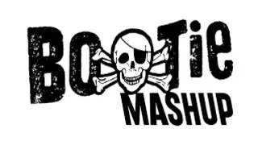

# Bootie Mashup Radio - iOS & tvOS

Official native iOS and tvOS application for **Bootie Mashup Radio**, streaming the best mashups 24/7.



## Android version
The android version can be found https://github.com/purplescorpion1/Bootie-Mashup-Radio

---

## Features

- 🎧 **24/7 High Quality Audio Streaming**: Automatic primary stream connection (`https://c7.radioboss.fm/stream/205`) with automatic seamless failover to secondary stream if needed.
- 📺 **iOS & tvOS Support**: Full support for iPhone, iPad, and Apple TV (tvOS 15.0+).
- 📻 **Live Now Playing & Coming Next Info**: Automatic metadata updates for current track, artist, and coming next track every 5 seconds.
- 🖼️ **Album Artwork Integration**: Real-time album artwork updates fetched directly from the stream feed with smooth fallback graphics.
- 🔊 **Mute / Unmute & Play / Pause Controls**: Simple, sleek touch controls matching the Android application layout.
- 📡 **AirPlay & Bluetooth Support**: Control playback via connected Bluetooth devices (headphones, car audio, Apple Watch) or stream to AirPlay receivers using the built-in route picker.
- 📱 **Lock Screen, Control Center & Media Remote Control**: Full integration with iOS `MPNowPlayingInfoCenter` and `MPRemoteCommandCenter` for remote playback control and background media playback.

---

## Compatibility

- **iOS**: iOS 15.0 or later (iPhone, iPad, iPod touch)
- **tvOS**: tvOS 15.0 or later (Apple TV 4K / Apple TV HD)

---

## Testing & Installation Guide

The GitHub Actions workflow automatically generates two types of build artifacts:

1. **Simulator Builds (`.zip`)**: Built for x86_64 / arm64 architecture, specifically designed for testing in online browser services (like [Appetize.io](https://appetize.io)) or Xcode iOS Simulator.
2. **Device Builds (`.ipa`)**: Built for physical iPhone & iPad hardware, ready for sideloading.

---

### Option 1: Install on a Physical iPhone / iPad (Device IPA)

1. Go to the **Releases** tab on this GitHub repository.
2. Install the `.ipa` onto your iPhone or iPad or Apple TV using your preferred sideloading method:
   - **[Sideloadly](https://sideloadly.io)** (Mac & Windows): Connect your device via USB, select your Apple ID, drag in `BootieMashupRadio-iOS-Device.ipa` or `BootieMashupRadio-tvOS-Device.ipa`, and click **Start**.
   - **[AltStore](https://altstore.io)**: Import `BootieMashupRadio-iOS-Device.ipa` or `BootieMashupRadio-tvOS-Device.ipa` into AltStore on your device.
   - **[TrollStore]** (if supported on your iOS version).

---

### tvOS instructions for sideloady
If you have an Apple TV with a USB port, simply plug it in to your computer and Sideloadly will detect it. If you have a portless Apple TV, sideloading will only work on macOS. A virtual macOS should also work as long as you are on the same network. <br>
<br>
For macOS to see your Apple TV, open Settings > Remotes & Devices > Remote App & Devices and keep it on that screen so Sideloadly will detect your Apple TV. <br>

### Option 2: Build from Source with Xcode

#### Prerequisites
- A Mac running macOS 12 or later
- Xcode 14.0 or later (with iOS and tvOS SDKs installed)
- An Apple ID (Free or Developer Account)

#### Steps:
1. Clone this repository:
   ```bash
   git clone https://github.com/purplescorpion1/Bootie-Mashup-Radio-IOS.git
   cd Bootie-Mashup-Radio-IOS
   ```
2. Open `BootieMashupRadio.xcodeproj` in Xcode:
   ```bash
   open BootieMashupRadio.xcodeproj
   ```
3. Select your desired target:
   - `BootieMashupRadio` for iPhone / iPad
   - `BootieMashupRadioTV` for Apple TV
4. In Xcode, go to **Signing & Capabilities** under target settings:
   - Check **Automatically manage signing**.
   - Select your personal or developer Apple ID Team.
5. Connect your device or choose an iOS Simulator, then click **Run** (`Cmd + R`).

---

## License & Credits

Copyright © Bootie Mashup Radio. All rights reserved.
